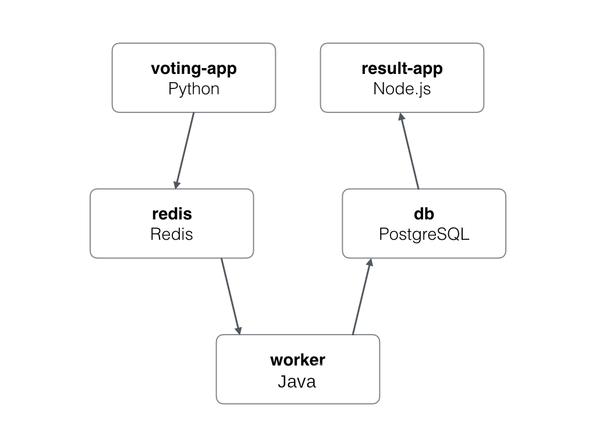

# Example Voting App

A simple distributed application running across multiple Docker containers.

## Getting started

Download [Docker Desktop](https://www.docker.com/products/docker-desktop) for Mac or Windows. [Docker Compose](https://docs.docker.com/compose) will be automatically installed.

On GNU/Linux, make sure you have recent versions of both [Docker](https://docs.docker.com/engine/install/#server) as well as [Docker Compose](https://docs.docker.com/compose/install/) installed.

### Requirements:

- Docker: 18.06.0 or later
- Docker Compose: 1.22.0 or later

## Containers

The stack uses [Python](https://www.python.org/), [Node.js](https://nodejs.org/), [Java](https://www.java.com/), with [Redis](https://redis.io/) for messaging and [PostgreSQL](https://www.postgresql.org/) for storage.

> If you're using [Docker Desktop on Windows](https://store.docker.com/editions/community/docker-ce-desktop-windows), run the Linux version by [switching to Linux containers](https://docs.docker.com/docker-for-windows/#switch-between-windows-and-linux-containers).

Run in this directory:

```
docker-compose up
```

The app will be running at [http://localhost:5000](http://localhost:5000), and the results will be at [http://localhost:5001](http://localhost:5001).

## Testing

A [functional test](/tests) is included that tests voting with 2 distinct users. This is written with [Mocha](https://mochajs.org/) and uses the [Puppeteer](https://developers.google.com/web/tools/puppeteer) headless browser.

To run the tests, remove stored data and run the tests service:

```
docker-compose down --volumes
docker-compose run --rm tests
```

## Continuous integration

Continuous integration will automatically [build and test](/.gitlab-ci.yml) each merge request using [Gitlab CI](https://docs.gitlab.com/ce/ci/).

## Architecture



- A front-end web app in [Python](/vote) which lets you vote between two options
- A [Redis](https://hub.docker.com/_/redis/) queue which collects new votes
- A [Java](/worker/src/main) worker which consumes votes and stores them in…
- A [PostgreSQL](https://hub.docker.com/_/postgres/) database backed by a Docker volume
- A [Node.js](/result) webapp which shows the results of the voting in real time

### Note

The voting application only accepts one vote per client. It does not register votes if a vote has already been submitted from a client.

## Infrastructure

Currently all application services are managed in Docker Compose, however there is a proof of concept in the `infra` directory which will be used to manage Amazon Web Services Infrastructure as Code resources for the project.

To use this, first change into the `infra` directory:

```
cd infra
```

This includes the following components:

- A [LocalStack](https://github.com/localstack/localstack) service which mocks AWS services for the purposes of local development/testing and CI (see below).
- [Terraform](https://www.terraform.io/)
  - Terraform is pre-configured to connect to Localstack and use the configuration files found in the [infra/terraform directory](infra/terraform).
- [AWS CLI](https://aws.amazon.com/cli/) which can be used for running [CloudFormation](https://aws.amazon.com/cloudformation/) and diagnostic tasks.
  - This is pre-configured to connect to Localstack and make the CloudFormation template found in the [infra/cloudformation directory](infra/cloudformation) available as `file://cloudformation.yaml`.
- A [Boto3](https://github.com/boto/boto3) based [infrastructure validation](infra/tests/test.py) Python script, also preconfigured to connect to LocalStack.

To use this, first change into the `infra` directory, start LocalStack and wait for it to come up:

```
cd infra
docker-compose run --rm localstack
# The following command will wait until LocalStack is fully started.
docker-compose run --rm aws s3api list-buckets
```

Once LocalStack has started you can run Terraform, AWS CLI or tests in another terminal as follows:

```
cd infra
docker-compose run --rm terraform
docker-compose run --rm aws
docker-compose run --rm tests
```

To reset LocalStack state:

```
cd infra
docker-compose down --volumes
```
